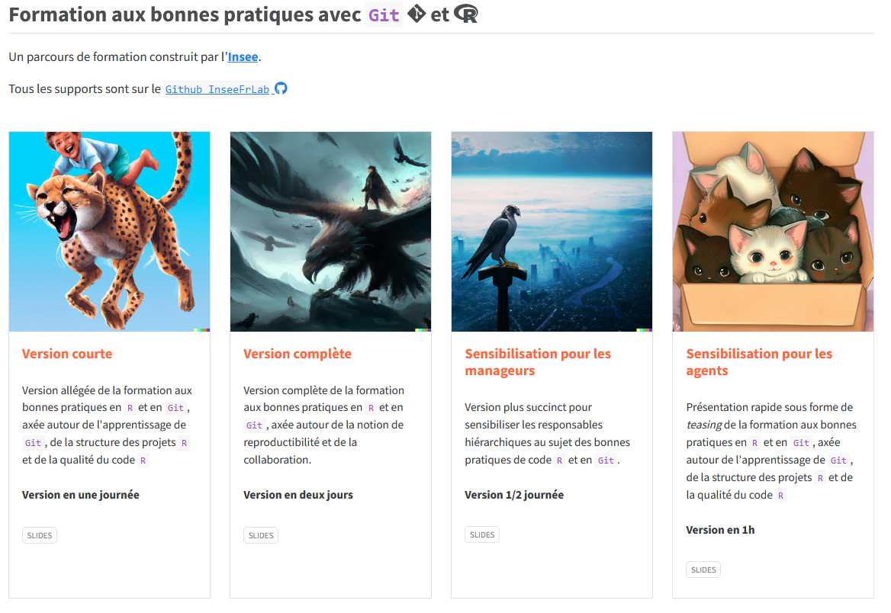

# Bonnes pratiques pour les projets statistiques avec `Git`  et 

  

 

Ensemble des supports des formations "__Bonnes pratiques pour les projets statistiques avec `Git` et `R`__" données à l'Insee et dans le [service statistique publique](https://www.insee.fr/fr/information/1302192).

Les supports de formation sont déployés sur un [site dédié](https://inseefrlab.github.io/formation-bonnes-pratiques-git-R/).

 

 

## Contenu

La formation est déployée en plusieurs versions pour s'adresser à
plusieurs types de publics. 

### Parcours "socle" (1 jour)

- **Partie 1** : **contrôle de version** avec `Git`
  - :one: Le contrôle de version : pourquoi faire ?
  - :two: `Git` en pratique

- **Partie 2** : **bonnes pratiques** avec `R`
  - :one: Qualité du code
  - :two: Structure des projets
  - :three: Formats de données

### Parcours "avancé" (2 jours)

- **Parcours socle** auquel s'ajoutent

- **Partie 1** : **contrôle de version** avec `Git`
  - :three: Travail collaboratif avec `Git`

- **Partie 2** : **bonnes pratiques** avec `R`
  - :four: Environnements reproductibles
  - :five: *Pipelines* de données
  - :six: Introduction à la publication reproductible

