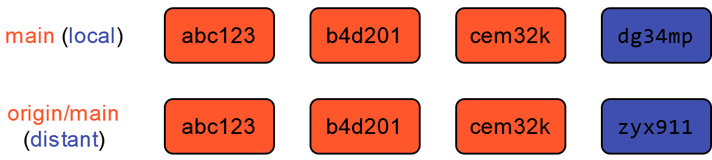
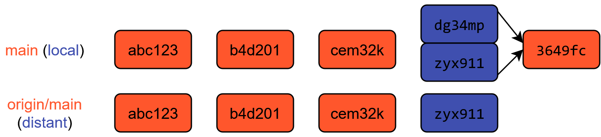
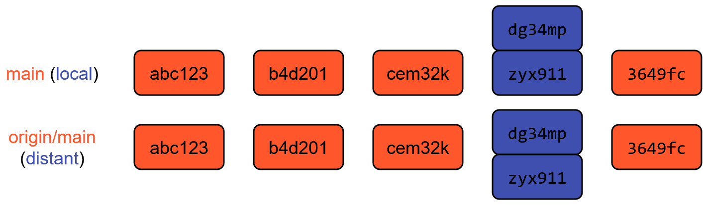
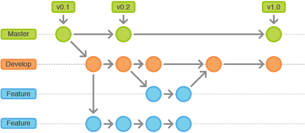
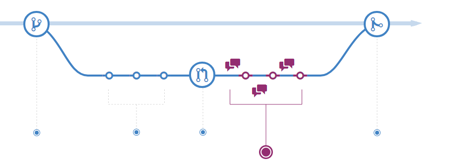

# III- Le travail collaboratif avec Git

## Outils pour le travail collaboratif

- L'éco-système `Git` [**facilite** le travail collaboratif]{.blue2}
    - `Git`  : modèle des [__branches__]{.orange}
    - `GitHub`  / `GitLab`  : [**Issues**, **Pull Requests**, **Forks**]{.orange}

- Ces outils ne remplacent pas une [**bonne définition de l'organisation du travail**]{.orange} en équipe
    - Choix d'un *workflow*
    - Droits d'accès
    - Règles de contribution



## Divergence d'historiques : cas simple {auto-animate=true}

- Si les deux *commits* concernent des **parties séparées du projet**, un `pull` préalable suffit à résoudre le problème
    

## Divergence d'historiques : cas simple {auto-animate=true}

- `Git` fusionne les deux *commits* en un [***merge commit***]{.blue2}
    - Les deux *commits* existent toujours dans l'historique !
    - L'historique est réconcilié → on peut `push`

## Divergence d'historiques : cas simple {auto-animate=true}

- Le dépôt local et le dépôt distant sont synchronisés 🤗





## Divergence d'historiques : cas compliqué

- Si les deux *commits* modifient les **mêmes parties du projet**, un `pull` ne suffit plus à résoudre le problème
    - `Git` ne peut pas décider quelle version prioriser 🤔
    - Il faut lui indiquer comment **résoudre le conflit**



## Le modèle des branches {auto-animate=true}

{fig-align="center"}

## Le modèle des branches {auto-animate=true}

## Exemple d'organisation : le *GitHub flow*

Description plus détaillée : [ici](https://docs.github.com/en/get-started/quickstart/github-flow)




