# IV- Environnements reproductibles

## Enjeux

- Imaginons la situation suivante :
  - J'installe une version de `R` sur mon poste
  - Je développe un projet en installant les _packages_ nécessaires
  - Une fois terminé, je passe au projet suivant, et ainsi de suite.


- Quels [**problèmes**]{.orange} puis-je rencontrer au fil des projets ?

- Est-il facile de [**partager**]{.orange} un de mes projets ?

## Enjeux

- [**Version de**]{.orange} [**R**]{.blue2} [**fixe**]{.orange}, celle de l'installation système


- [**Conflits de version**]{.orange} : différents projets peuvent requérir différentes versions d'un même _package_.


- [**Reproductibilité limitée**]{.orange} : difficile de dire quel projet nécessite quel _package_.


- [**Portabilité limitée**]{.orange} : difficile de préciser dans un fichier les dépendances spécifiques à un projet.


## Des environnements reproductibles avec `renv`

- `renv` permet de créer des **env**ironnements **r**eproductibles


- [**Isolation**]{.orange} : chaque projet dispose de sa propre librairie de packages


- [**Reproductibilité**]{.orange} : `renv` enregistre les versions exactes des *packages* nécessaires au projet


- [**Portabilité**]{.orange}: un tiers peut exécuter le projet avec les mêmes spécifications

## Utilisation de `renv`

1. [**Initialisation**]{.orange} (`init`) de l'environnement local du projet


2. [**Développement**]{.orange} du projet


3. [**Enregistrement**]{.orange} (`snapshot`) des versions des *packages* installés


4. [**Restauration**]{.orange} (`restore`) d'un environnement

## :one: Initialisation de l'environnement

- `renv::init()` dans un projet RStudio crée :
  - Un dossier `renv` et le fichier `.Rprofile` : activation automatique de l'environnement
  - Le fichier `renv.lock` : versions des *packages* installés

. . .

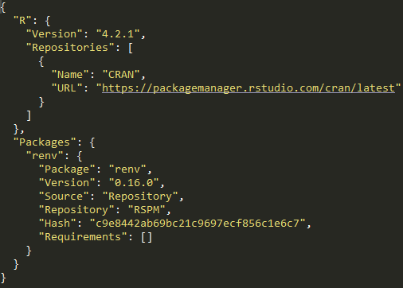{height="400" fig-align="center"}

## :two: Développement du projet

- Une fois l'environnement initialisé, on développe le projet de manière habituelle :
  - Installations/suppressions/mises à jour de packages
  - Ecriture de scripts

- `renv::status()` : indique les _packages_ installés/supprimés par rapport au fichier `renv.lock`

## :three: Enregistrement de l'environnement {.smaller}

- `renv::snapshot()` : enregistre les versions des _packages_ installés dans le fichier `renv.lock`

- Ne pas oublier de committer le fichier `renv.lock`!

. . .

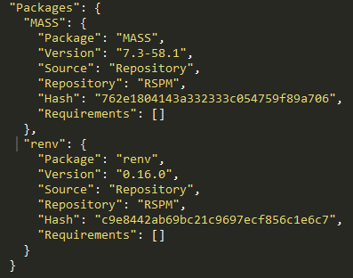{height="350" fig-align="center"}

## :four: Restauration de l'environnement

- `renv::restore()` : installe/désinstalle les _packages_ nécessaires pour arriver à l'état spécifié dans le fichier `renv.lock`


- [**Portabilité**]{.orange} : un tiers peut recréer un environnement avec les mêmes spécifications





## Vers une reproductibilité optimale

- [**Limites**]{.orange} des environnements virtuels : 
  - Les [**librairies système**]{.blue2} ne sont pas gérées
  - Lourdeur de la phase d'installation à chaque changement d'environnement
  - Peu adaptés à un environnement de production


- La [**conteneurisation**]{.orange} (ex : `Docker`) apporte la solution


- [**Intuition**]{.orange} : au lieu de distribuer la recette pour recréer l'environnement, [**distribuer directement une "machine" qui contient *tout* l'environnement nécessaire au projet**]{.blue2}

## Ressources supplémentaires

- La [documentation officielle de `renv`](https://rstudio.github.io/renv/articles/renv.html)

- La [fiche utilitR sur la gestion des dépendances](https://book.utilitr.org/03_Fiches_thematiques/Fiche_gerer_dependances)


# V- `R` en production

## De quoi parle-t-on ?

- [**Production statistique**]{.orange} : chiffres, données, analyses produits par l'Insee / les SSM

- [**Production informatique**]{.orange} : processus maintenus par la [**DSI**]{.blue2} sur des [**infrastructures avec "garantie de service"**]{.blue2}

- [**Self de production**]{.orange} : processus maintenus par le [**métier**]{.blue2} sur une [**infrastructure "self"**]{.blue2}

- [**Code de production**]{.orange} : code respectant des [**standards de qualité**]{.blue2} qui le rendent [**efficace**]{.blue2} et [**maintenable**]{.blue2}

## `R` : un langage de production ?

- `R` a émergé dans la [**communauté statistique**]{.orange}
  - Outils d'[**analyse interactive**]{.blue2} très développés
  - Outils de [**développement**]{.blue2} limités

- L'[**éco-système tidyverse**]{.orange} s'oriente vers des outils [***production-ready***]{.blue2}

. . .

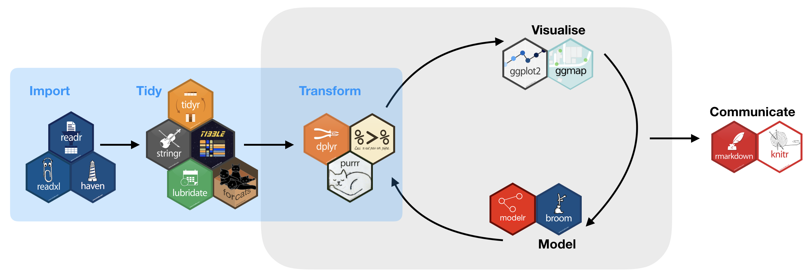{height="250" fig-align="center"}

## Les trois commandements d'Hadley

- Le [**code de production**]{.orange} a trois caractéristiques
  - [**"Not just me"**]{.blue2}
  - [**"Not just once"**]{.blue2}
  - [**"Not just my computer"**]{.blue2}

. . .

{height="250" fig-align="center"}

## Les trois commandements d'Hadley

::: {.nonincremental}
- Le [**code de production**]{.orange} a trois caractéristiques
  - [**"Not just me"**]{.blue2}
  - <span style="color: lightgrey;"><strong>"Not just once"</strong></span>
  - <span style="color: lightgrey;"><strong>"Not just my computer"</strong></span>

{height="250" fig-align="center"}
:::

## "Not just me"

- Penser son projet en termes de [**maintenabilité**]{.orange}

- Adopter les [**standards communautaires**]{.orange}
  - [**Git**]{.blue2} pour la [**traçabilité**]{.blue2} des choix
  - [**Qualité**]{.blue2} du code (structure, documentation)
  - Choix des [**packages**]{.blue2} (voir [fiche UtilitR](https://book.utilitr.org/03_Fiches_thematiques/Fiche_comment_choisir_un_package.html))

. . .

::: {style="font-size: 70%; text-align: justify"}
> "Le simple fait qu’un package fasse (ou semble faire) ce que vous voulez n’est pas une raison suffisante de l’utiliser, surtout si votre programme doit rester fonctionnel pendant une longue période. Déterminer si on peut utiliser un package revient à faire un arbitrage entre avantages et inconvénients, et à évaluer le risque d’instabilité d’un package."
>
> [UtilitR](https://book.utilitr.org/03_Fiches_thematiques/Fiche_comment_choisir_un_package.html)
:::

## "Not just me"

- Organiser le [**travail collaboratif**]{.orange}
  - S'accorder sur une [**organisation**]{.blue2}
  - Des outils facilitant via l'[**écosystème `Git`**]{.blue2}

- Traiter le code comme un [**élément méthodologique**]{.orange}
  - [**Revue de code**]{.blue2}

. . .

::: {style="font-size: 70%; text-align: justify"}
> "Les développeurs, quel que soit leur rôle, y voient de multiples avantages et un contexte dans lequel ils peuvent se former mutuellement, maintenir l'intégrité des bases de code de leurs équipes et créer, établir et faire évoluer des normes qui garantissent la lisibilité et la cohérence du code."
>
> [Sadowski et al., *Modern Code Review: a Case Study at Google* (2018)](https://dl.acm.org/doi/abs/10.1145/3183519.3183525)
:::

## "Not just me"

- Penser à l'expérience des [**utilisateurs finaux**]{.orange}

- Pour la mise à disposition de données : [Parquet](https://book.utilitr.org/03_Fiches_thematiques/Fiche_import_fichiers_parquet.html)
  - [**Interopérable**]{.blue2} et [**méta-données**]{.blue2} incluses
  - Performances en [**stockage**]{.blue2} et en [**lecture**]{.blue2}

- Pour la documentation / publication : [quarto](https://quarto.org/)
  - Intègre [**code**]{.blue2} et [**texte**]{.blue2} pour la [**reproductibilité**]{.blue2}
  - Publication [**multi-formats**]{.blue2} (`pdf`, `odt`, `html`)

- Exemple "2 en 1" : [utiliser les données RP en `Parquet`](https://ssphub.netlify.app/post/parquetrp/)

## Les trois commandements d'Hadley

::: {.nonincremental}
- Le [**code de production**]{.orange} a trois caractéristiques
  - <span style="color: lightgrey;"><strong>"Not just me"</strong></span>
  - [**"Not just once"**]{.blue2}
  - <span style="color: lightgrey;"><strong>"Not just my computer"</strong></span>

{height="250" fig-align="center"}
:::

## "Not just once"

- Penser son projet en termes de [**reproductibilité**]{.orange}

- Une tâche de [**production**]{.orange}
  - Est [**répétée**]{.blue2} dans le temps
  - Peut [**changer d'environnement**]{.blue2} (dev, test, prod...)

- [**Problème**]{.orange} : le monde "autour du code" évolue
  - [**Spécifier**]{.blue2} et [**contrôler**]{.blue2} l'environnement
  - [**Automatiser**]{.blue2} ce qui peut l'être

## "Not just once"

- Les [**données**]{.orange} changent
  - [**Factoriser**]{.blue2} le code avec des [**fonctions**]{.blue2}
  - [**Modéliser**]{.blue2} sa chaîne sous forme de [**DAG**]{.blue2}

. . .

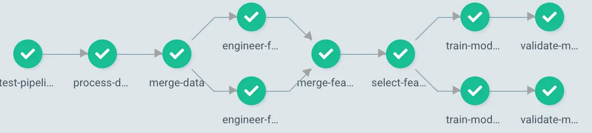{height="250" fig-align="center"}

- Outil : [{targets}](https://books.ropensci.org/targets/)

## "Not just once"

- Le [**code**]{.orange} / les [**données**]{.orange} changent... et [**cassent**]{.orange}

- Spécifier les [**attendus**]{.orange}
  - [**Tests unitaires**]{.orange} : vérifie le bon [**comportement**]{.blue2} du code
  - [**Validation de données**]{.orange} : vérifie l'[**intégrité**]{.blue2} et la [**qualité**]{.blue2} des données

- Outils : [testthat](https://testthat.r-lib.org/) et [pointblank](https://rstudio.github.io/pointblank/)

## "Not just once"

- Les [**dépendances**]{.orange} changent (fonctionnalités, *bugs*, failles de sécurité...)

- Arbitrage entre [**évolutivité**]{.orange} et [**stabilité**]{.orange}
  - L'[**évolution des dépendances**]{.blue2} est inhérente à la [**maintenance**]{.blue2} d'une chaîne de production

- On limite les risques en [**spécifiant l'environnement**]{.orange}
  - [**Fixer**]{.blue2} les versions des packages utilisés : [renv](https://rstudio.github.io/renv/articles/renv.html)
  - [**Versionner**]{.blue2} sa chaîne de production : tags [Git](https://git-scm.com/doc)

## "Not just once"

- L'[**environnement**]{.orange} change (OS, libs système, `R`...)
  - Difficulté principale du [**passage en production**]{.blue2}

- La [**conteneurisation**]{.orange} permet de [**fixer l'environnement**]{.orange}
  - Favorise la [**portabilité**]{.blue2}

. . .

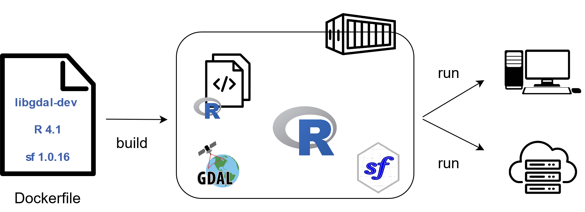{height="250" fig-align="center"}

## "Not just once"

- Concevoir sa chaîne comme un [***pipeline* de données**]{.orange}
  - [**Reproductibilité**]{.orange} : étapes [**intégrées**]{.blue2} "de bout en bout"
  - [**Stabilité**]{.orange} : contrôle des [**évolutions**]{.blue2}
  - [**Portabilité**]{.orange} : fluidifie le [**changement d'architecture**]{.blue2}

- Avantage supplémentaire : [**automatisation**]{.orange}

- Outil : [**intégration continue**]{.orange} via `GitHub` / `GitLab`
  - Accroît encore les bénéfices d'utiliser `Git` ! 

## Les trois commandements d'Hadley

::: {.nonincremental}
- Le [**code de production**]{.orange} a trois caractéristiques
  - <span style="color: lightgrey;"><strong>"Not just me"</strong></span>
  - <span style="color: lightgrey;"><strong>"Not just once"</strong></span>
  - [**"Not just my computer"**]{.blue2}

{height="250" fig-align="center"}
:::

## "Not just my computer"

- Evolution continue vers des infrastructures de [**self "*production-ready*"**]{.orange}

. . .

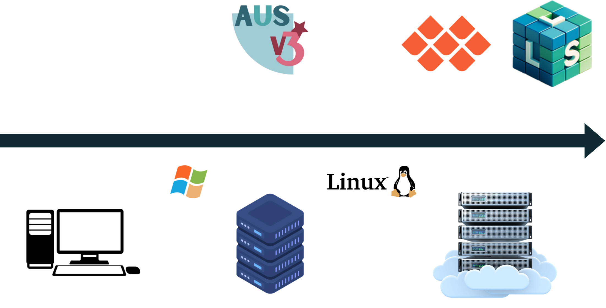{height="400" fig-align="center"}

## "Not just my computer"

- OK, mais pourquoi 🤔 ?

- Pourquoi migrer vers des [**infrastructures centralisées**]{.orange} ?
  - [**Centralisation**]{.orange} : permet le [**passage à l'échelle**]{.blue2}
  - [**Sécurité**]{.orange} : évite la [**dissémination**]{.blue2} de données

- Pourquoi migrer vers des [**infrastructures Kubernetes**]{.orange} ?
  - Tout ce qu'on pouvait faire avant... [**en mieux**]{.blue2}
  - [**Nouveaux usages**]{.orange} : déploiements (applications, API), calcul distribué, traitements ordonnancés...
  - [**Autonomie**]{.orange} (environnement, stockage, etc.)

## "Not just my computer" {auto-animate=true}

Un point de départ commun

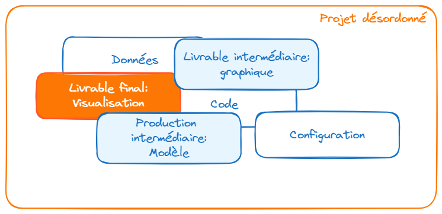

## "Not just my computer" {auto-animate=true}

Un point de départ commun {width="10%" fig-align="right"}

Une structuration de projet plus viable

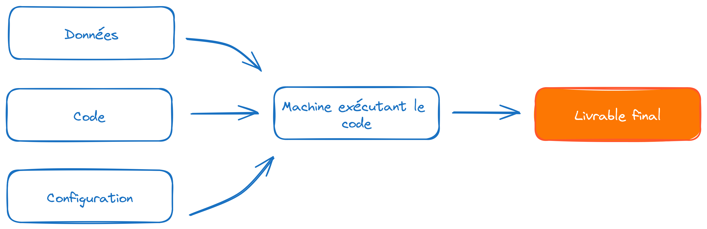

## "Not just my computer" {auto-animate=true}

Un point de départ commun {width="10%" fig-align="right"}

Une structuration de projet plus viable {width="10%" fig-align="right"}

Facilitée par [**l'éco-système *cloud***]{.orange}

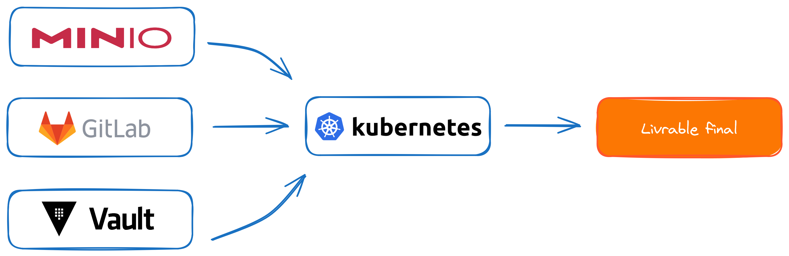

## "Not just my computer"
  
- Qu'est-ce qui change 🤔 ? 

- [**Techniquement**]{.orange}, tout... ou presque !
  - Du monde [***desktop***]{.blue2} au monde [***server***]{.blue2}
  - Du monde [***Windows***]{.blue2} au monde [***Linux***]{.blue2}

- En pratique, [**Onyxia**]{.orange} facilite la [**transition**]{.orange}

. . .

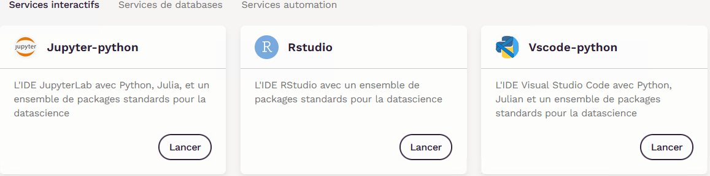{height="250" fig-align="center"}

## "Not just my computer"

- Qu'est-ce qui change 🤔 ?

- [**Monde conteneurisé**]{.orange} : les traitements sont [**éphémères**]{.orange}
  - "Coût" de l'[**autonomie**]{.blue2} et de la [**mutualisation**]{.blue2} 
  - Mais source de [**reproductibilité**]{.blue2} !

. . .

{height="300" fig-align="center"}

## "Not just my computer"

- Qu'est-ce qui change 🤔 ? 
  - Evolution du [**mode de stockage de données**]{.orange}

- Infrastructures [**"bureau virtuel"**]{.orange} : [**lecteurs partagés**]{.blue2}
  - Le "bureau virtuel" simule le [***filesystem* traditionnel**]{.blue2}

- Infrastructures [**cloud**]{.orange} : [**stockage objet**]{.orange} (`S3` / `MinIO`)
  - Stockage [**très peu coûteux**]{.blue2} 
  - [**Autonomie**]{.orange} : [***bucket***]{.blue2} personnel / de projet
  - [**Fonctionnement différent**]{.blue2} des *filesystems*

## "Not just my computer"

- Qu'est-ce qui change 🤔 ? 

- Evolution de la [**nature des traitements**]{.orange}
  - Traitements [**interactifs**]{.blue2} pour le [**développement**]{.blue2}
  - Traitements [**batch**]{.blue2} pour le [**déploiement**]{.blue2}

- Le [**débogage**]{.orange} devient moins immédiat
  - Nécessité du [***logging***]{.blue2} : [logger](https://cran.r-project.org/web/packages/logger/vignettes/Intro.html)

## Dépasser le "mur de la production"

- Une organisation limitée par l'[**hétérogénéité des environnements**]{.orange}

. . .

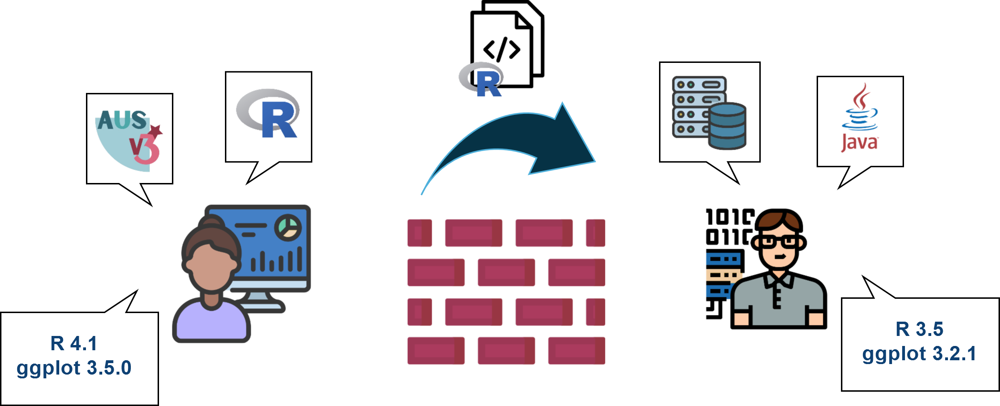{height="400" fig-align="center"}

## Dépasser le "mur de la production"

- L'opportunité d'organisations [**plus continues**]{.orange}

. . .

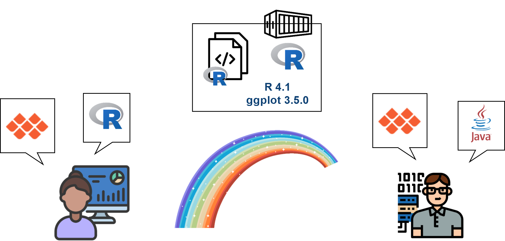{height="450" fig-align="center"}


## Application 5: partie 1 {.smaller}

:::: {.callout-tip .nonincremental collapse="true" icon=false}
## Partie 1 : transition vers le stockage `S3`

<!-------
Tout au long de la formation, on se plaçait déjà dans le paradigme *cloud* dans la mesure où l'on développait dans des **conteneurs** hébergés sur des serveurs distants. Néanmoins, on a traité le stockage de manière "traditionnelle", en important/exportant les fichiers depuis/vers le stockage **local** au conteneur. L'objectif de cet exercice est de transitionner vers un stockage *cloud*, en l'occurence le stockage de type `S3`.
---------->

1. En début de script, créer les chemins où les données pourront être trouvées (voir ci-dessous)
2. Créer un connecteur `Arrow` entre votre session `R` et l'espace de stockage `S3`

```{.r}
bucket <- s3_bucket(bucket_formation, endpoint_override = Sys.getenv("AWS_S3_ENDPOINT"))
bucket_path <- bucket$path(paste0(path_within_bucket, "/RPindividus"))
```

3. Dans `main.R`, modifier les codes utilisant `open_dataset` pour remplacer les chemins par la variable `bucket_path`.

```{.r}
df <- open_dataset(
  bucket_path,
  hive_style = TRUE
) %>%
  filter(REGION == 24) %>%
  select(any_of(columns_subset)) %>%
  collect()
```

4. Si nécessaire, remplacer l'import du geojson 

```{.r}
departements <- aws.s3::s3read_using(
  FUN = sf::st_read, 
  object = "france.geojson", 
  bucket = paste0(bucket_formation, "/", path_within_bucket),
  opts = list("region" = "")
  )

```


<br>

<details>

<summary>
Connecteur pour la question 1
</summary>

::: {.panel-tabset}

##  


```{.r}
bucket_formation <- "projet-formation"
path_within_bucket <- "/bonnes-pratiques/data"
```

##  Insee


```{.r}
bucket_formation <- "public"
path_within_bucket <- "/ssplab-formation"
```

:::


</details>


::::

## Application 5: partie 2 {.smaller}

:::: {.callout-tip collapse="true" icon=false}
## Partie 2 : orchestrer sa chaîne de production

Au fil des chapitres précédents, nous avons appliqué un ensemble de bonnes pratiques à notre chaîne de production pour accroître sa qualité et sa maintenabilité. Néanmoins, celle-ci est encore sous la forme d'un unique *script*. 

De manière générale, on a plutôt envie de modéliser les étapes d'une chaîne comme une série de fonctions, avec une fonction "cheffe d'orchestre" qui appelle les autres dans le bon ordre.

::: {.nonincremental}

1. Créer les scripts suivants:
  * `R/functions_import.R` ([contenu](https://raw.githubusercontent.com/InseeFrLab/formation-bonnes-pratiques-git-R/refs/heads/main/R/checkpoints/application5_part2/R/functions_import.R))
  * `R/functions_stats_desc.R` ([contenu](https://raw.githubusercontent.com/InseeFrLab/formation-bonnes-pratiques-git-R/refs/heads/main/R/checkpoints/application5_part2/R/functions_stats_desc.R))
  * `R/functions_models.R` ([contenu](https://raw.githubusercontent.com/InseeFrLab/formation-bonnes-pratiques-git-R/refs/heads/main/R/checkpoints/application5_part2/R/functions_models.R))

2. Modifier `main.R` pour tenir compte de la modularisation ([version  + sspcloud](https://raw.githubusercontent.com/InseeFrLab/formation-bonnes-pratiques-git-R/refs/heads/main/R/checkpoints/application5_part2/main_sspcloud.R) ou [version  + LS3](https://raw.githubusercontent.com/InseeFrLab/formation-bonnes-pratiques-git-R/refs/heads/main/R/checkpoints/application5_part2/main_sspcloud_ls3.R))

3. Passer la souris sur une des nouvelles fonctions et faire <kbd>F1</kbd>

:::

::::


::: {.callout-note}
## `targets`: un orchestrateur formel

On aurait pu également utiliser un **orchestrateur** dédié pour effectuer cette tâche, comme le package [targets](https://books.ropensci.org/targets/). Les plus curieux d'entre vous pourront aller voir [le chapitre et les exercices](https://github.com/InseeFrLab/formation-bonnes-pratiques-git-R/blob/main/slides/legacy/data_pipelines.qmd) qui lui étaient auparavant dédiés dans cette formation.

:::

## Application 5: partie 3 {.smaller}


:::{.callout-tip collapse="true" icon=false .noincremental}
## Partie 3 : ajout de contrôles de qualité des données

Un critère de qualité majeur d'une chaîne de production est sa robustesse. Naturellement, les données en entrée de la chaîne peuvent évoluer dans le temps. Afin de gérer au mieux les risques posés par de telles évolutions, on va ajouter des contrôles sur la qualité des données, en entrée et en sortie de la chaîne.

:::

:::{.callout-tip collapse="true" icon=false .noincremental}
## Partie 4 : tests unitaires et versionnage de la chaîne

Notre chaîne tourne à présent de manière robuste. Pour autant, ce n'est pas un objet fixe : on peut vouloir lui apporter des corrections ou des améliorations fonctionnelles. Et ces modifications peuvent, à leur tour, provoquer des nouvelles erreurs. Pour gérer ces risques, on va :
- versionner la chaîne, afin de certifier le code qui la fait tourner sans erreur à un moment T
- implémenter des tests unitaires, qui permettent de continuer à modifier la chaîne sans risquer de **régressions**

:::

:::{.callout-tip collapse="true" icon=false .noincremental}
## Partie 5 : un rapport reproductible pour documenter sa chaîne de production

Une bonne manière de favoriser à la fois la maintenabilité de sa chaîne et la réutilisationde ses produits est de documenter son fonctionnement. Le format [quarto](https://quarto.org) — successeur de `R Markdown` — permet de reproduire facilement des **rapports reproductibles, qui intègrent code et texte**. En plus, ces rapports peuvent être facilement publiés en différents formats, du plus **interactif** (`html`) aux plus classiques (`pdf`, `odt`, etc.).

:::

:::{.callout-tip collapse="true" icon=false .noincremental}
## Partie 6 : automatiser la mise à disposition

On dispose finalement d'une chaîne **orchestrée, robuste et bien documentée**. Afin d'en faire une chaîne vraiment intégrée de bout en bout, on va **automatiser** les étapes, de sorte à ce que les modifications apportées au projet se répércutent sur ses sorties. Pour cela, on va utiliser les outils de l'**intégration continue** proposés par `GitHub` / `GitLab`.

:::